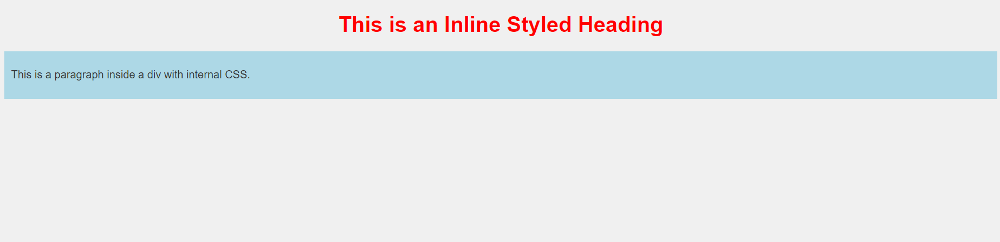

# Challenge 01: How to Add CSS

In this challenge, you'll explore the three different ways to add CSS to an HTML document: External, Internal, and Inline CSS. You'll also practice the cascading order and how it affects the appearance of an element when multiple styles are applied.

## Objectives:
- Learn how to apply **External CSS** by linking a separate `.css` file to an HTML page.
- Implement **Internal CSS** within the `<style>` tag in the head of the document.
- Apply **Inline CSS** directly to an HTML element using the `style` attribute.
- Understand how **Cascading Order** works when multiple styles are applied to the same element.

## Instructions:

1. Create an external CSS file named `styles.css` and link it to your HTML document using the `<link>` element inside the `<head>`.
    - Add some styles (e.g., background color, font size) for the body and paragraph elements in this file.

2. Add internal CSS styles inside the `<style>` element in the `<head>` section of your HTML document.
    - Add a unique style for a `div` element.

3. Use inline CSS to style a specific heading (`h1`) element directly in the HTML code using the `style` attribute.
    - Change its color and text alignment.

4. Test how cascading order works by adding styles for the same element using external, internal, and inline CSS. Notice which style takes precedence.

### Example: 

```html
<!-- HTML Structure -->
<!DOCTYPE html>
<html lang="en">
<head>
    <meta charset="UTF-8">
    <meta name="viewport" content="width=device-width, initial-scale=1.0">
    <title>CSS Challenge</title>
    
    <!-- External CSS -->
    <link rel="stylesheet" href="styles.css">

    <!-- Internal CSS -->
    <style>
        div {
            background-color: lightblue;
            padding: 10px;
        }
    </style>
</head>
<body>

    <h1 style="color: red; text-align: center;">This is an Inline Styled Heading</h1>

    <div>
        <p>This is a paragraph inside a div with internal CSS.</p>
    </div>

</body>
</html>
```

#### Final Result: 



---

### Solution

- [HTML Solution](./index.html)
- [CSS Solution](./styles.css)