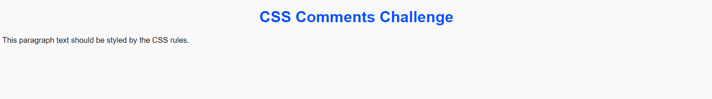

# Challenge 02: CSS Comments

In this challenge, you will practice adding comments in both HTML and CSS. Comments are important for documenting your code, helping you or others understand its structure and purpose. They are ignored by the browser but can be extremely helpful when maintaining or revisiting your code later.

## Objectives:
- Understand how to add comments in CSS using the `/* ... */` syntax.
- Learn how to add comments in HTML using the `<!-- ... -->` syntax.
- Explore how comments can be used to explain sections of code or disable parts of CSS temporarily.
- Practice organizing your CSS code by adding meaningful comments.

## Instructions:

1. Create an HTML document with the following structure:
   - Include a `<style>` block in the `<head>` section where you will write some CSS rules.
   - Add a few HTML elements (e.g., headings, paragraphs, divs) to the body for styling.

2. Inside the CSS section:
   - Add comments to document your CSS rules.
   - Disable one of the CSS rules by commenting it out, so you can see the effect of removing the rule temporarily.
   
3. Inside the HTML file:
   - Add comments to explain different sections of the HTML structure (e.g., what each `
` represents).
   
4. Ensure that the comments are clear and descriptive, especially for future use or collaboration.

### Tasks:

1. Add CSS comments to document the styling in your CSS file.

2. Add HTML comments to describe your HTML structure.

3. Comment out at least one CSS rule and observe the difference in the rendered page.

#### Final Result:

