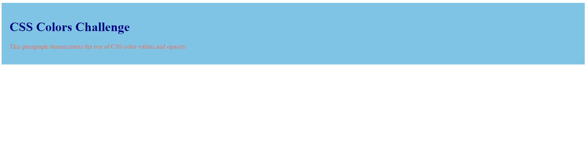

# Challenge 03: CSS Colors

In this challenge, you'll practice using different methods to specify colors in CSS. You'll work with color names, RGB, HEX, HSL, RGBA, and HSLA values to style an HTML document. By the end of the challenge, you should be comfortable using these different color formats and understand how they affect the appearance of web elements.

## Objectives:
- Use predefined color names in CSS.
- Apply RGB, HEX, and HSL color values to style HTML elements.
- Experiment with RGBA and HSLA to set opacity levels for colors.
- Understand how color values interact with lightness, saturation, and alpha transparency.

## Instructions:

1. Create an HTML document that includes:
   - A heading (`<h1>`), a paragraph (`
`), and a `
` section for experimenting with colors.
   - A separate CSS file for all the styling where you will apply your CSS rules.

2. Apply the following tasks:
   - Set a background color for the `
` using a predefined color name.
   - Set the text color of the `<h1>` element using an RGB value.
   - Use a HEX value to set the color of the `
` element text.
   - Set the background color of the `
` with an HSL value.
   - Apply RGBA to the paragraph text and make it 50% transparent.
   - Use HSLA to give the `
` a partially transparent background.

## Tasks:
1. Set a background color for the `
` using a color name.
2. Use an RGB value to color the `<h1>` text.
3. Set the paragraph color using a HEX value.
4. Set the `
` background color using an HSL value.
5. Make the paragraph text 50% transparent using RGBA.
6. Set the `
` background to 50% transparent using HSLA.

### Solution Files:
- `index.html` with external CSS for different color values and formats.
- `styles.css` containing all the CSS styles for the challenge.

#### Final Result:

---

### Solution

- [HTML Solution](./index.html)
- [CSS Solution](./styles.css)