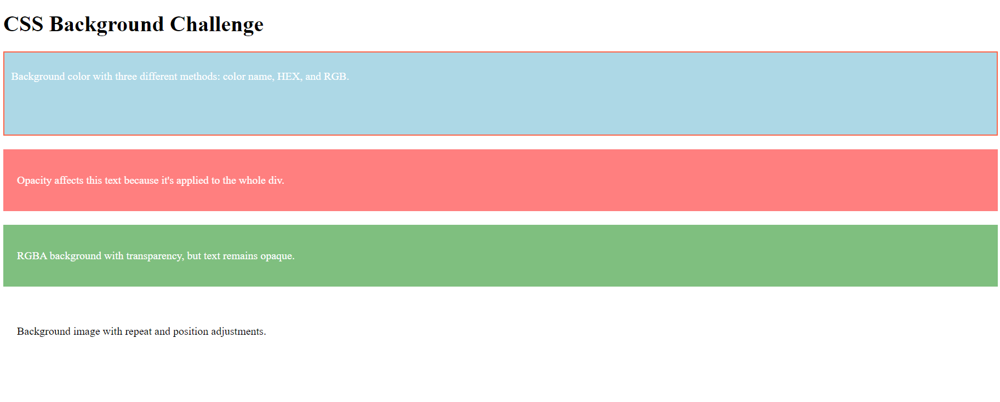

# Challenge: CSS Background Properties

## Description:
In this challenge, you'll explore and apply various CSS background properties. You will learn how to add background colors, images, control their repetition, set transparency, and use shorthand to apply multiple background properties at once.

## Tasks:

### 1. Background Color
Create a `div` and apply a background color using three different methods:
- **Color name**
- **HEX**
- **RGB**

### 2. Opacity
- Use the `opacity` property to create a `div` with different levels of transparency. Show how it affects the child elements within.
- Now, create another `div` where the background color uses **RGBA** for transparency, leaving the text unaffected.

### 3. Background Image
- Set an image as the background of a `div`.
- Ensure the image does not repeat by default, then modify the CSS so the image repeats horizontally and vertically.

### 4. Background Repeat and Position
- Modify the previous background image settings to repeat only horizontally.
- Set the position of the image to display in the center of the `div`.

### 5. Background Attachment
- Create a background image that scrolls with the page, and another that remains fixed while the page scrolls.

### 6. Shorthand Background Property
- Use the CSS `background` shorthand to apply multiple properties (color, image, repeat, attachment, and position) in a single line.

## Final Result:

