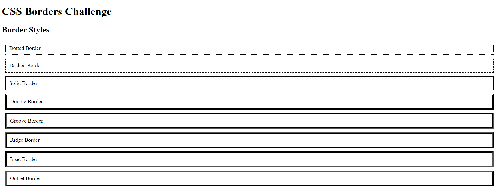

# Challenge 05: CSS Borders

## Description:
In this challenge, you will explore and apply various CSS border properties. You will learn how to set border styles, widths, colors, and use shorthand to combine multiple border properties.

## Tasks:

### 1. Border Styles
Create a `div` and apply the following border styles:
- **dotted**
- **dashed**
- **solid**
- **double**
- **groove**
- **ridge**
- **inset**
- **outset**

### 2. Border Width
- Set different border widths (thin, medium, thick) for each of the borders (top, right, bottom, left) of a `div`.
- Experiment by using specific width values in `px`, `em`, or `cm`.

### 3. Border Color
- Apply the border color using three different methods:
  - **Color name** (e.g., "red")
  - **HEX** (e.g., `#ff0000`)
  - **RGB** (e.g., `rgb(255, 0, 0)`)
  - **HSL** (e.g., `hsl(0, 100%, 50%)`)

### 4. Border Sides
- Create a `div` with different border styles for each side. For example:
  - Top border: **dotted**
  - Right border: **solid**
  - Bottom border: **double**
  - Left border: **dashed**

### 5. Border Shorthand
- Use the CSS `border` shorthand to apply all the individual border properties (style, width, color) in a single line for a `div`.

### 6. Border Radius
- Create a `div` with rounded corners using the `border-radius` property.

## Bonus Task:
- Try to create a circle or oval shape using the `border-radius` property.

## Final Result:

---

### Solution

- [HTML Solution](./index.html)
- [CSS Solution](./styles.css)
