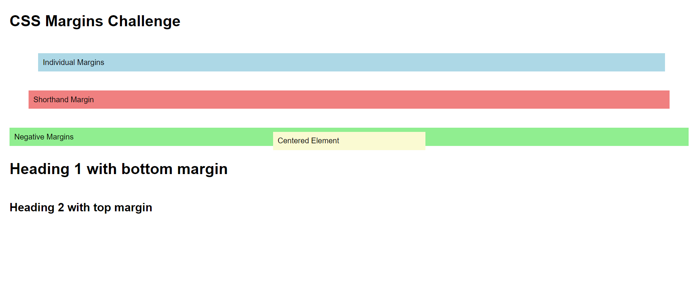

# Challenge 06: CSS Margins

## Description:
In this challenge, you'll practice using the CSS margin properties to create space around elements. You'll explore setting margins for individual sides of elements, using the shorthand property, and applying negative margins. Additionally, you'll learn about the auto value for centering elements and margin collapse behavior.

## Tasks:

### 1. Individual Margins
- Create four `div` elements and apply the following margins:
  - Top: 30px
  - Right: 50px
  - Bottom: 40px
  - Left: 60px

### 2. Margin Shorthand
- Use the shorthand `margin` property to apply the following margin values in a single line for a `div` element:
  - Top: 20px
  - Right and Left: 40px
  - Bottom: 60px

### 3. Negative Margins
- Apply negative margin values to a `div` element:
  - Top: -20px
  - Bottom: -30px

### 4. Centering an Element
- Set the `margin` of a `div` element to `auto` to horizontally center it within its container. Ensure the element has a specified `width`.

### 5. Margin Collapse
- Create two heading elements (`h1` and `h2`) with a bottom margin of 50px and a top margin of 20px, respectively. Observe how the vertical margins between them collapse into a single margin due to CSS margin collapse.

## Notes:
- Experiment with different margin values to see how they affect the layout of your page.
- Be sure to include comments in your code to explain what each margin property is doing.

## Final Result:
