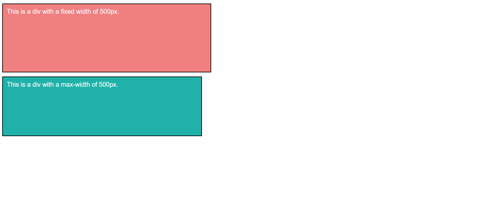

# Challenge 08: CSS Height, Width, and Max-width

## Description
In this challenge, you will practice using CSS height, width, and max-width properties. You will understand how these properties influence the layout and responsiveness of elements on the page.

## Instructions
1. Create two `div` elements with some text inside.
2. Set the first `div` to a fixed width of `500px` and observe how it behaves when you resize the window.
3. Set the second `div` with a `max-width` of `500px` and test its behavior when resizing the window.
4. Set a height for both `div` elements and observe how content fits within the defined height.

## Requirements
- The first `div` must have a width of `500px` and a fixed height.
- The second `div` must use `max-width` to handle responsiveness.
- Both `div` elements should adjust their size when the browser window is resized.

## Bonus
- Experiment with padding and margin for both `div` elements.
- Add `min-height` and `min-width` properties to explore further control of the element size.

## Final Result:

