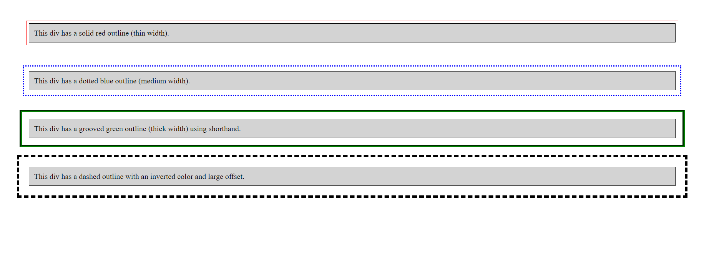

# Challenge 09: CSS Outline 

## Objective
In this challenge, you will explore the various outline properties in CSS, including outline width, color, and shorthand properties. Your goal is to practice using these properties to make HTML elements stand out while distinguishing outlines from borders.

### Instructions:
1. Create an HTML file with multiple `div` elements containing some text.
2. Apply different outline properties to each `div` element, including:
   - **Outline width** using `outline-width` with values such as `thin`, `medium`, `thick`, or specific sizes like `px`, `em`, etc.
   - **Outline color** using `outline-color` with values specified as:
     - Color name (e.g., "red")
     - HEX value (e.g., `#ff0000`)
     - RGB (e.g., `rgb(255, 0, 0)`)
     - HSL (e.g., `hsl(0, 100%, 50%)`)
     - Invert (which ensures that the outline is visible, regardless of background color)
   - **Outline shorthand** using `outline` to combine `outline-width`, `outline-style`, and `outline-color` in one property.
   - **Outline offset** using `outline-offset` to create space between the outline and the border of the element.
3. Ensure that the outline does not affect the element's total dimensions.

### Requirements:
- Your `div` elements should demonstrate **at least 4 different outline colors**, widths, and styles.
- Use the **outline shorthand** to simplify some of your CSS.
- Adjust the `outline-offset` for each style to show the effect of spacing between the outline and the border.
- Add a thin black border to the elements to visually distinguish between the border and the outline.

### Bonus:
- Experiment with the `invert` color option to create an outline that automatically contrasts with the background.
- Use a combination of different color formats (HEX, RGB, HSL) in your outlines.

### Final Result:

---

### Solution

- [HTML Solution](./index.html)
- [CSS Solution](./styles.css)

Good luck, and have fun experimenting with the power of CSS outlines!
