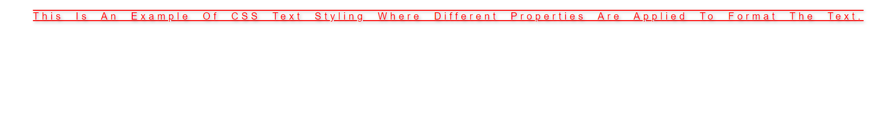

# Challenge 11: CSS Text Styling

## Description:

In this challenge, you will work with various CSS properties for formatting text. You will explore how to style text using color, alignment, decoration, transformation, spacing, and shadows.

## Instructions:

1. Create an HTML file with a paragraph of text.
2. Style the text using the following CSS properties:
   - **Text color**: Apply a color of your choice using different formats (color name, HEX, or RGB).
   - **Text alignment**: Center-align the text.
   - **Text decoration**: Add an underline and overline.
   - **Text transform**: Capitalize the first letter of each word.
   - **Letter spacing**: Increase the space between characters.
   - **Word spacing**: Increase the space between words.
   - **Line height**: Adjust the space between lines of text.
   - **Text shadow**: Add a shadow effect to the text.

## Example:

Create a paragraph that:
- Has red text.
- Is center-aligned.
- Has both underline and overline decoration.
- The first letter of each word is capitalized.
- Includes 5px spacing between characters and 10px between words.
- Has 1.5 line-height.
- Has a subtle shadow effect.

## Final Result:

---

### Solution

- [HTML Solution](./index.html)
- [CSS Solution](./styles.css)