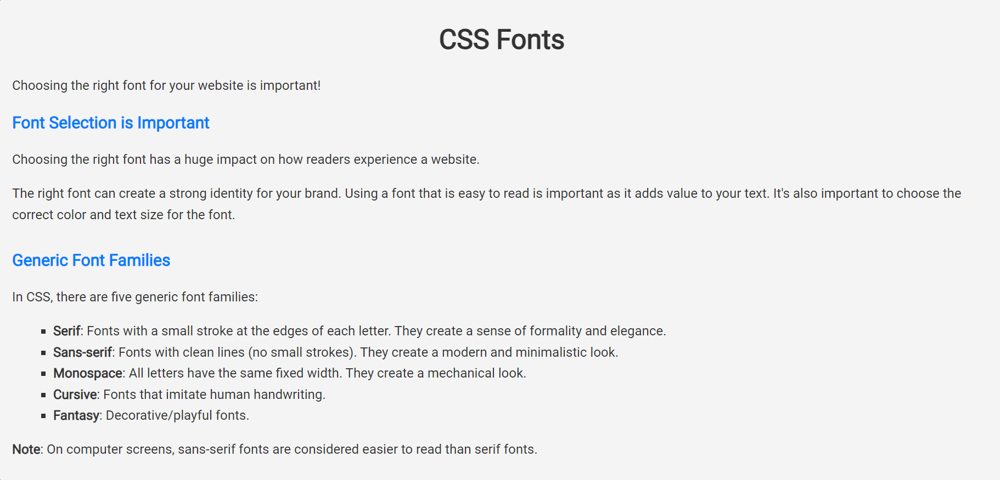
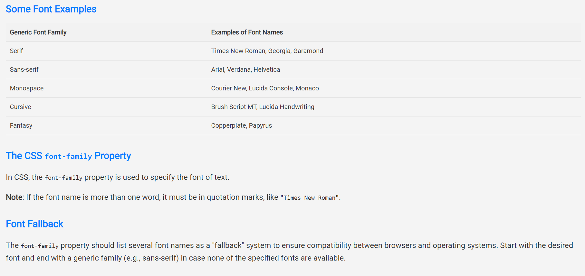
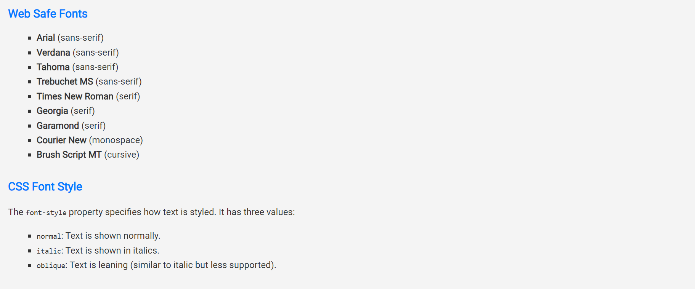
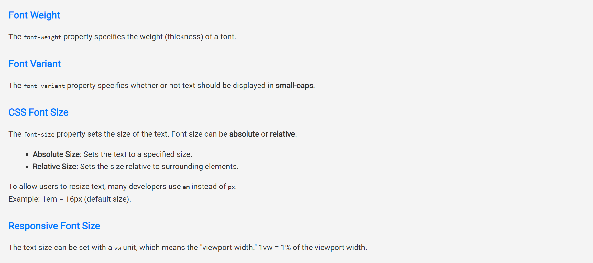
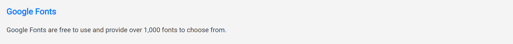

# Challenge 12: CSS Fonts

Choosing the right font for your website is important!

## Font Selection is Important
Choosing the right font has a huge impact on how readers experience a website.

The right font can create a strong identity for your brand. Using a font that is easy to read is important as it adds value to your text. It's also important to choose the correct color and text size for the font.

## Generic Font Families
In CSS, there are five generic font families:

- **Serif**: Fonts with a small stroke at the edges of each letter. They create a sense of formality and elegance.
- **Sans-serif**: Fonts with clean lines (no small strokes). They create a modern and minimalistic look.
- **Monospace**: All letters have the same fixed width. They create a mechanical look.
- **Cursive**: Fonts that imitate human handwriting.
- **Fantasy**: Decorative/playful fonts.

**Note**: On computer screens, sans-serif fonts are considered easier to read than serif fonts.

### Some Font Examples

| Generic Font Family | Examples of Font Names          |
| ------------------- | ------------------------------ |
| Serif               | Times New Roman, Georgia, Garamond |
| Sans-serif          | Arial, Verdana, Helvetica        |
| Monospace           | Courier New, Lucida Console, Monaco |
| Cursive             | Brush Script MT, Lucida Handwriting |
| Fantasy             | Copperplate, Papyrus            |

## The CSS `font-family` Property
In CSS, the `font-family` property is used to specify the font of text.

**Note**: If the font name is more than one word, it must be in quotation marks, like `"Times New Roman"`.

### Font Fallback
The `font-family` property should list several font names as a "fallback" system to ensure compatibility between browsers and operating systems. Start with the desired font and end with a generic family (e.g., sans-serif) in case none of the specified fonts are available.

## Web Safe Fonts
**Web safe fonts** are fonts that are universally installed across all browsers and devices.

However, there are no 100% completely web safe fonts, so it's important to always use **fallback fonts**. Always end your list of fonts with a generic family name.

### Best Web Safe Fonts for HTML and CSS:
- **Arial** (sans-serif)
- **Verdana** (sans-serif)
- **Tahoma** (sans-serif)
- **Trebuchet MS** (sans-serif)
- **Times New Roman** (serif)
- **Georgia** (serif)
- **Garamond** (serif)
- **Courier New** (monospace)
- **Brush Script MT** (cursive)

### Arial (sans-serif)
Arial is the most widely used font for both online and printed media. It is available on all major operating systems and is the default font in Google Docs.

## CSS Font Style
The `font-style` property specifies how text is styled. It has three values:
- `normal`: Text is shown normally.
- `italic`: Text is shown in italics.
- `oblique`: Text is leaning (similar to italic but less supported).

## Font Weight
The `font-weight` property specifies the weight (thickness) of a font.

## Font Variant
The `font-variant` property specifies whether or not text should be displayed in **small-caps**.

## CSS Font Size
The `font-size` property sets the size of the text.

You should not use font size adjustments to make paragraphs look like headings or vice versa. Always use proper HTML tags, like `<h1>` - `<h6>` for headings and `<p>` for paragraphs.

Font size can be **absolute** or **relative**.

### Absolute Size:
- Sets the text to a specified size.
- Does not allow users to change the text size in some browsers (bad for accessibility).

### Relative Size:
- Sets the size relative to surrounding elements.
- Allows users to change the text size in browsers.

**Note**: The default font size for normal text is `16px` (1em).

### Setting Font Size with Pixels
If you use pixels, you can still use the zoom tool to resize the entire page.

### Setting Font Size with Em
To allow users to resize text, many developers use `em` instead of `px`.

- 1em = the current font size.
- Default size = 16px, so 1em = 16px.

#### Example: Converting Pixels to Em
To convert pixels to em: `pixels / 16 = em`.

### Responsive Font Size
The text size can be set with a `vw` unit, which means the "viewport width." 1vw = 1% of the viewport width.

## Google Fonts
Google Fonts are free to use and provide over 1,000 fonts to choose from.

### How to Use Google Fonts:
1. Add a special `<link>` tag in the `<head>` section of your HTML.
2. Refer to the font in your CSS with `font-family`.

**Note**: Always include a fallback font to avoid unexpected behaviors.

### Using Multiple Google Fonts
To use multiple Google fonts, separate the font names with a pipe character (`|`). For example:

```html
<link href="https://fonts.googleapis.com/css2?family=Roboto&family=Open+Sans&display=swap" rel="stylesheet">
```
### Warning:
Requesting multiple fonts may slow down your web pages!

---

### Enabling Font Effects
Google also provides different font effects. You can add effects by using `effect=effectname` in the Google API link.

---

### CSS Great Font Pairings
Pairing fonts is essential for great design. Here are some rules for font pairing:

- **Complement**: Pair fonts that harmonize without being too similar or too different.
- **Use Font Superfamilies**: Superfamilies are fonts designed to work well together (e.g., Lucida Sans and Lucida Serif).
- **Contrast is King**: Serif and sans-serif font combinations work well.
- **Choose One Boss**: Use size, weight, and color to establish font hierarchy.

---

### Popular Google Font Pairings:
Some great font pairings can be found with Google Fonts.

---

### The CSS `font` Shorthand Property
You can specify all the individual font properties using the `font` shorthand property.

#### Syntax:

```css
font: font-style font-variant font-weight font-size/line-height font-family;
```

**Note**: `font-size` and `font-family` are required. If other values are omitted, their default values will be used.

---

### All CSS Font Properties:
- `font`: Sets all the font properties in one declaration.
- `font-family`: Specifies the font family.
- `font-size`: Specifies the font size.
- `font-style`: Specifies the font style.
- `font-variant`: Specifies small-caps font.
- `font-weight`: Specifies the weight of a font.

## Final Result:





