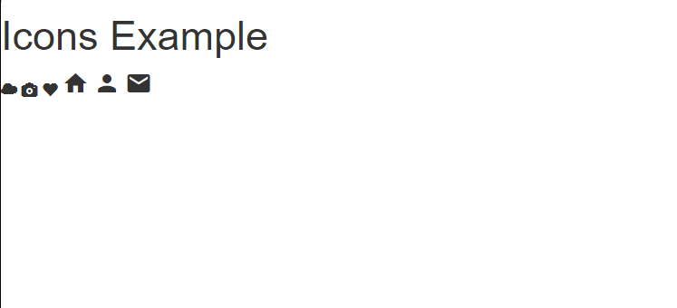

# Challenge 13: CSS Icons

## Description
In this challenge, you will add scalable vector icons to your HTML page using an icon library. You will then customize the icons using CSS. You can choose from Font Awesome, Bootstrap Glyphicons, or Google Material Icons.

### Steps:
1. Choose one of the following icon libraries:
   - **Font Awesome**: Visit [Font Awesome](https://fontawesome.com/start) to get the script code.
   - **Bootstrap Glyphicons**: Use [Bootstrap 3 Glyphicons](https://getbootstrap.com/docs/3.3/components/).
   - **Google Material Icons**: Use [Google Material Icons](https://fonts.google.com/icons).
2. Add the necessary script or link tag to the `<head>` section of your HTML file.
3. Insert icons into your page using HTML elements like `<i>` or `` with the appropriate icon classes.
4. Use CSS to customize the icons, such as changing their size, color, or adding shadows.

### Requirements:
- Use at least one icon library.
- Customize the icons using CSS (e.g., size, color, shadow).
- Include at least three different icons from the chosen library.

### Bonus:
- Use icons from all three libraries on the same page.
- Add hover effects to change the icons’ appearance (e.g., change color or size on hover).

### Resources:
- [Font Awesome](https://fontawesome.com/start)
- [Bootstrap Glyphicons](https://getbootstrap.com/docs/3.3/components/)
- [Google Material Icons](https://fonts.google.com/icons)

## Final Result:

Good luck!

