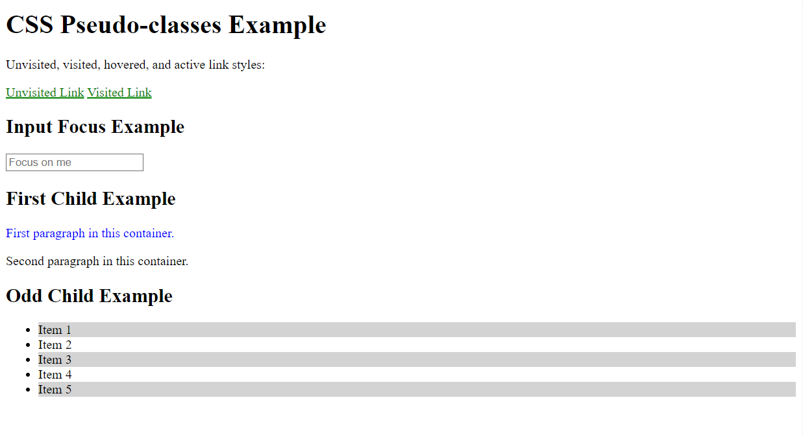

# Challenge 15: CSS Pseudo-classes 

## Description:
In this challenge, you will use CSS pseudo-classes to style elements based on their state or position within the document structure. You will implement pseudo-classes to style different elements, such as links, input fields, and child elements, based on their interaction with the user.

## Task:
1. Style links using the `:link`, `:hover`, `:visited`, and `:active` pseudo-classes.
2. Use the `:focus` pseudo-class to style an input field when it is focused.
3. Apply the `:first-child` pseudo-class to change the color of the first paragraph in a list of paragraphs.
4. Use the `:nth-child(odd)` pseudo-class to style every odd item in a list.

## Requirements:
- Style unvisited links with a different color.
- When hovering over a link, change its color and underline it.
- For visited links, apply a different color.
- The active link (while being clicked) should have a specific style.
- When an input field receives focus, change its border color.
- Style the first paragraph in any container with a blue color.
- Every odd item in a list should have a different background color.

## HTML Code:

```html
<!DOCTYPE html>
<html lang="en">
<head>
    <meta charset="UTF-8">
    <meta name="viewport" content="width=device-width, initial-scale=1.0">
    <title>CSS Pseudo-classes Challenge</title>
    <link rel="stylesheet" href="style.css">
</head>
<body>

    <h1>CSS Pseudo-classes Example</h1>

    <p>Unvisited, visited, hovered, and active link styles:</p>
    <a href="#">Unvisited Link</a>
    <a href="#">Visited Link</a>

    <h2>Input Focus Example</h2>
    <input type="text" placeholder="Focus on me">

    <h2>First Child Example</h2>
    <div class="container">
        <p>First paragraph in this container.</p>
        <p>Second paragraph in this container.</p>
    </div>

    <h2>Odd Child Example</h2>
    <ul>
        <li>Item 1</li>
        <li>Item 2</li>
        <li>Item 3</li>
        <li>Item 4</li>
        <li>Item 5</li>
    </ul>

</body>
</html>
```
## Final Result:


---

### Solution

- [HTML Solution](./solution15.html)
- [CSS Solution](./style.css)
