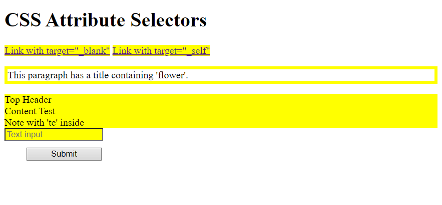

# Challenge 17: CSS Attribute Selectors

**Objective:**  
Learn how to style HTML elements using specific attributes with CSS attribute selectors.

## Instructions:
1. Style all `<a>` elements with a `target` attribute to have a yellow background.
2. Select and style all `<a>` elements with `target="_blank"` to also have a yellow background.
3. Select and style elements that have a `title` attribute containing the word "flower" with a 5px solid yellow border.
4. Style elements with a `class` attribute that starts with "top" to have a yellow background.
5. Style elements with a `class` attribute that ends with "test" to have a yellow background.
6. Style elements with a `class` attribute that contains the string "te" to have a yellow background.
7. For forms:
   - Style all text input fields (`input[type="text"]`) to have a yellow background and 150px width.
   - Style all button inputs (`input[type="button"]`) to be 120px wide.

## Bonus:
Use any other attribute selectors you know to add more styles.

## Expected Result:
Your HTML should display different elements styled based on their attributes as specified.

## Final Result:

---

### Solution

- [HTML Solution](./solution17.html)
- [CSS Solution](./style.css)
