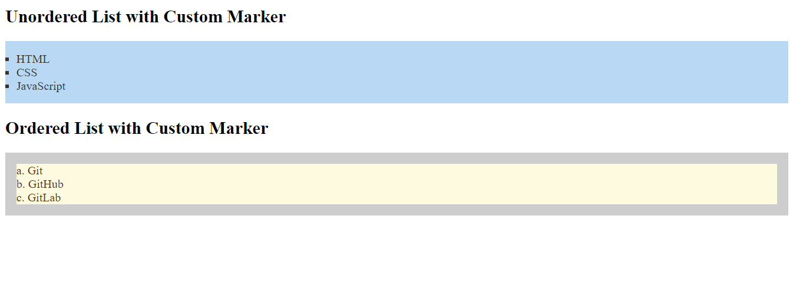

# Challenge 18: CSS lists

In this challenge, you'll create two lists and customize them using CSS properties like `list-style-type`, `list-style-position`, and `list-style-image`.

## Task:

1. Create an unordered list with three items: `HTML`, `CSS`, and `JavaScript`. Apply the following styles:
   - Use a `square` as the list item marker.
   - Set the list item markers outside the list items.
   - Set a background color of `#f0f8ff` for the list and padding of `15px`.
   - Set a text color of `#333` for each list item.

2. Create an ordered list with three items: `Git`, `GitHub`, and `GitLab`. Apply the following styles:
   - Use `lower-alpha` for the list item marker.
   - Set the list item markers inside the list items.
   - Set a background color of `#faf0e6` for the list and padding of `15px`.
   - Set a background color of `#fefae0` and a text color of `#663300` for each list item.

3. Use the `list-style-image` property to set an image as the marker for the unordered list items.

## Bonus:

- Add custom hover effects to change the text color of list items when hovered.

## Final Result:

---

### Solution

- [HTML Solution](./solution18.html)
- [CSS Solution](./style.css)