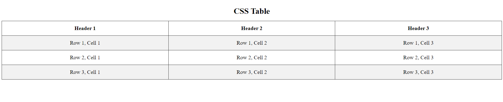

# Challenge: CSS Tables

## Objective
In this challenge, your task is to style a table using various CSS properties to enhance its appearance and usability. You will be applying borders, width settings, alignment, padding, and responsive design techniques.

## Instructions
1. **Create a table** that includes a header and multiple rows of data.
2. **Add a caption** for the table to describe its content, and style it to stand out.
3. **Add a border** to the table, header, and data cells using the `border` property.
4. **Set the table width** to make it span the full width of the screen.
5. **Use `border-collapse`** to ensure the table borders are collapsed, creating a cleaner look.
6. **Center-align the text** in all cells, and adjust vertical alignment as desired.
7. **Add padding** to the cells to create space between the text and the borders.
8. **Apply a hover effect** to highlight each row when the mouse hovers over it.
9. **Implement a zebra-striping effect** where every other row has a different background color.
10. Make the table **responsive** so that it displays a scrollbar if the screen is too narrow.

## Requirements
- Add a caption element for the table and style it using the `.caption` class.
- Use `width: 100%` for the table.
- Add `border-collapse: collapse` to remove double borders.
- Use `text-align` and `vertical-align` for proper alignment.
- Add `padding` to table cells for spacing.
- Use `:hover` for highlighting rows.
- Use `nth-child` selector for zebra-striping.
- Add a container with `overflow-x: auto` for responsiveness.

## Final Result:

---

Happy Coding!
