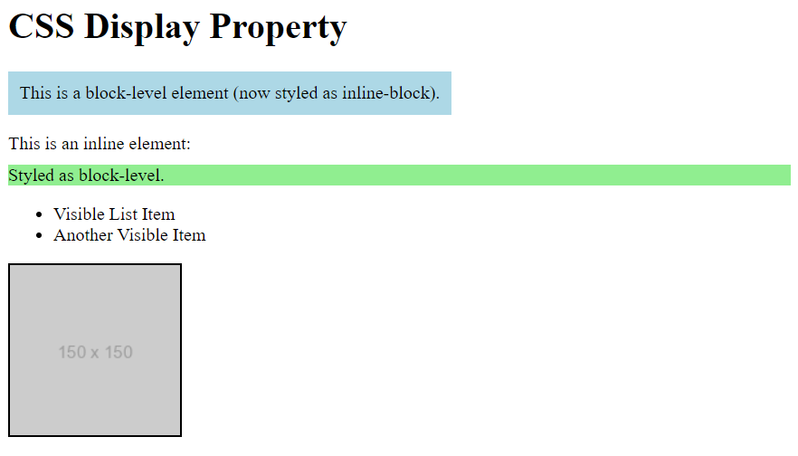

# CSS Challenge 20: CSS Layout - The display Property

## Task

Your task is to create an HTML page styled with CSS to demonstrate various values of the CSS `display` property. The goal is to understand how each `display` value affects the layout and behavior of HTML elements.

## Instructions

1. Create an HTML file and include the following elements:
   - A `
` block-level container with some text.
   - A `` inline element inside a paragraph.
   - A list of items `<ul>` with `<li>` elements.
   - An image element ``.

2. Write CSS rules to apply the following `display` property values to elements:
   - Set the `
` to have `display: inline-block`.
   - Set the `` to have `display: block`.
   - Set one `<li>` in the list to `display: none`.
   - Set the image to `display: inline`.

3. Observe the changes in layout and behavior of these elements and ensure the visual results align with the expected behavior of the `display` property.

## Expected Outcome

When you complete this challenge, you should see:
- The `
` container displayed as an inline-level block element, which allows it to maintain its block behavior while sitting inline with other elements.
- The `` displayed as a block element, breaking the line and taking the full width.
- One `<li>` item from the list hidden, with the rest of the list items unaffected.
- The image displayed inline, aligning naturally with the text content.

---

### Bonus
- Use `display: flex` on a container element and observe how its child elements behave.
- Experiment with `display: grid` to create a simple grid layout.

## Final Result:

---

Happy Coding!