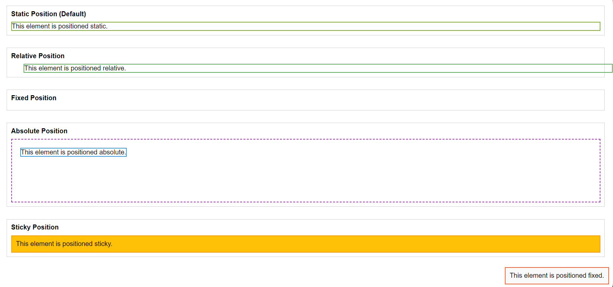

# Challenge 21 : CSS Layout - The Position Property

## Objective
Learn and practice the `position` property in CSS by applying various positioning methods to HTML elements.

## Task
Create an HTML page that demonstrates the following positioning methods:
1. `static`
2. `relative`
3. `fixed`
4. `absolute`
5. `sticky`

Each example should:
- Include a styled element positioned using the specified `position` value.
- Clearly show how the element behaves in the layout.

## Instructions
1. Create an HTML file.
2. Add a container for each position type with a descriptive label.
3. Use CSS to apply the corresponding `position` value and related properties (`top`, `left`, `bottom`, `right`) to each element.
4. Ensure your page is responsive and visually clear.

## Final Result:

### Bonus
- Add a sticky header that sticks to the top when scrolled.
- Add descriptive comments in your HTML and CSS code explaining each position type.

---

Good luck and happy coding!
