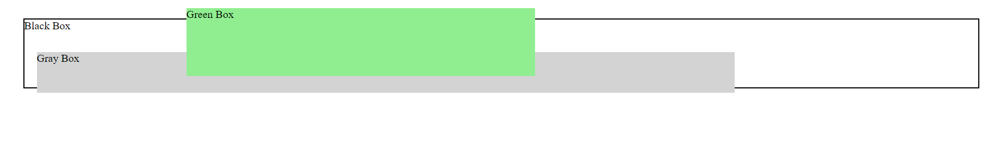

# CSS Challenge 22: z-index Property

## Objective
Learn how the `z-index` property affects the stacking order of positioned elements and how to control the visual layers of your webpage.

---

## Challenge

Create a layout with three overlapping boxes:  
1. A **Black Box** at the bottom.  
2. A **Gray Box** on top of the Black Box but behind the Green Box.  
3. A **Green Box** at the very top.

Use the `z-index` property to control the stacking order. Make sure to position the elements correctly.

---

## Requirements

1. The boxes should have the following colors and dimensions:
   - **Black Box**: Border color black, height 100px, and positioned relative.
   - **Gray Box**: Background color light gray, height 60px, width 70%, and positioned absolute.
   - **Green Box**: Background color light green, width 35%, height 100px, and positioned absolute.

2. Ensure the `z-index` values are applied as follows:
   - The **Black Box** should have the lowest stacking order.
   - The **Gray Box** should be between the Black and Green boxes.
   - The **Green Box** should appear at the top.

3. Include a comment in your CSS file explaining how `z-index` values control the stacking order.

---

## Example Output

Your output should look like this:

- The **Black Box** appears at the bottom.
- The **Gray Box** overlaps the Black Box.
- The **Green Box** overlaps both the Black and Gray boxes.

---

## Hints

- Remember, `z-index` only works on elements with a `position` value of `relative`, `absolute`, `fixed`, or `sticky`.
- Experiment with different `z-index` values to see the effect.

## Final Result:

---

### Bonus

- Add a `hover` effect to change the color of each box.
