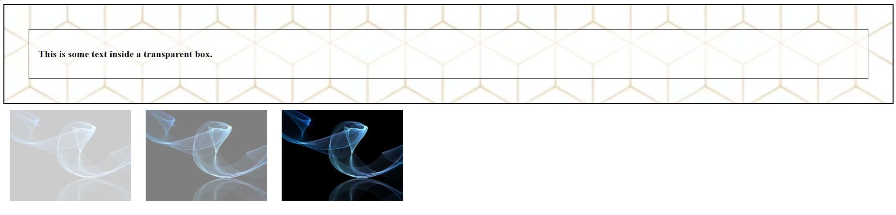

# CSS Challenge 23: CSS Opacity and Transparency

## Description
In this challenge, you'll practice using the `opacity` property and explore how it interacts with child elements and hover effects. You'll create a transparent box with text inside it, as well as images that change their opacity when hovered over.

## Instructions
1. Create a webpage with the following elements:
   - A **background image** for the main container.
   - A **semi-transparent box** placed over the background.
   - **Bold text** inside the semi-transparent box that remains fully visible.
   - Three images with different opacity levels (0.2, 0.5, and 1.0).
   - Implement a hover effect for the images:
     - When the mouse hovers over an image, its opacity should change to `1.0`.
     - Add a reversed hover effect for at least one image (e.g., opacity changes to `0.5` when hovered).

2. Use the `opacity` property and the `:hover` selector to achieve the desired effects.

## Requirements
- The semi-transparent box must not apply its opacity to the text inside it.
- The hover effect for the images must work smoothly.
- Use `rgba()` for setting the transparency of the box background.

## Example Output
- A background image with a semi-transparent box and bold, readable text.
- Three images below the box, each with different opacity levels, responding to hover interactions.

### Hints
- Use `opacity` for images and `rgba()` for the transparent box to prevent text opacity from being affected.
- Experiment with different values for `opacity` to understand its impact.

## Final Result:

---

## Bonus Challenge
Add a button inside the transparent box with its own hover effect that changes its background color and opacity.
