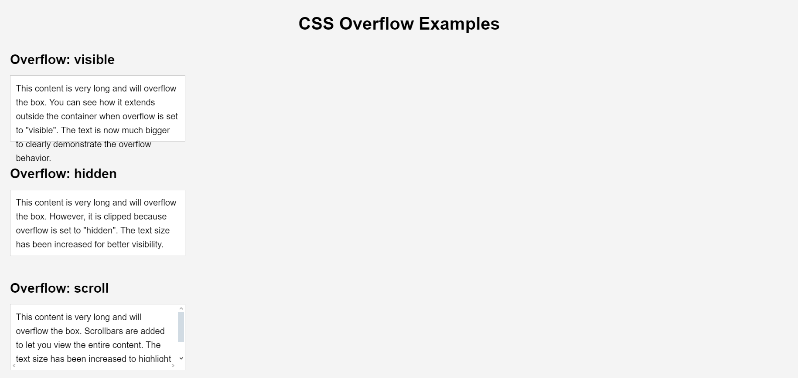
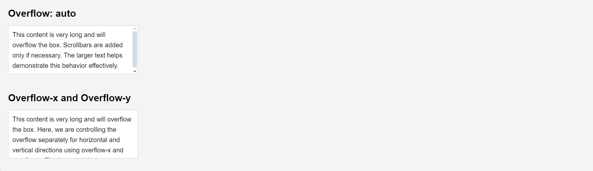

# Challenge 24: CSS Overflow

In this challenge, you will explore the `overflow` property in CSS. You will create a simple layout where content exceeds the container size. Your task is to use the `overflow` property to control how the content is displayed.

## Requirements

1. Create a container with a fixed width and height.
2. Add content that exceeds the container's dimensions.
3. Use the following `overflow` property values to control the behavior:
   - `visible`
   - `hidden`
   - `scroll`
   - `auto`
4. Experiment with `overflow-x` and `overflow-y` to handle horizontal and vertical overflow separately.

## Goals

- Understand how the `overflow` property works.
- Learn the difference between `overflow`, `overflow-x`, and `overflow-y`.
- Implement scrollable areas within your web pages.

## Final Result:

---

Good luck, and have fun!
