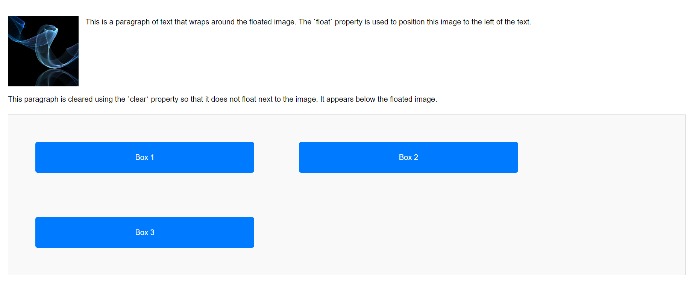

# CSS Challenge: Float and Clear

## Objective
Create a simple webpage that demonstrates the use of the `float` and `clear` properties along with a clearfix hack.

## Instructions
1. Add an image that floats to the left of a paragraph of text.
2. Add another paragraph below the first one that uses the `clear` property to ensure it appears below the floated image.
3. Create a container with multiple boxes floated to the left. Use the clearfix hack to prevent layout issues.

## Requirements
- Use the `float` property to position the image and boxes.
- Use the `clear` property to control the positioning of elements below floated elements.
- Implement the modern clearfix hack to handle container overflow caused by floated elements.

## Bonus
Add some styles to make the layout visually appealing.

---

### Example Layout
- An image floating to the left of a paragraph.
- A second paragraph cleared below the image.
- A container with three floated boxes aligned horizontally, cleared using the clearfix hack.

## Deliverables
- A `.html` file with the solution.
- A `.css` file with the styles.
