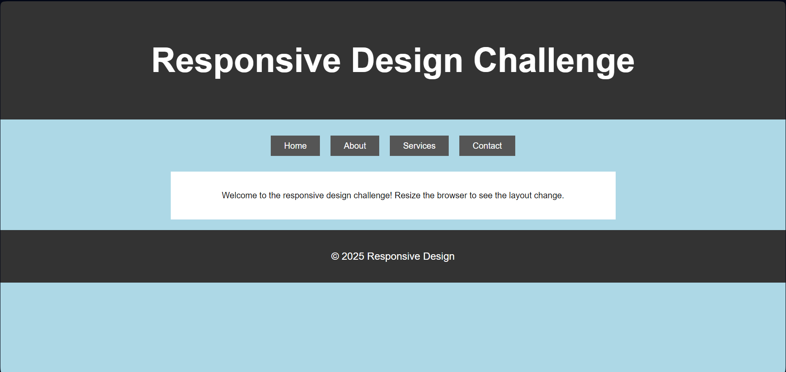

# Challenge 27: Responsive Design with CSS Media Queries

In this challenge, you'll create a responsive web page that adjusts its layout and styles based on the width of the viewport. The goal is to practice using CSS media queries to create a responsive design.

## Instructions

1. Create a simple HTML page with the following elements:
   - A header with a title.
   - A navigation menu with links.
   - A main content area.
   - A footer.

2. Style the page to look good on smaller screens (less than 480px) and larger screens (480px or wider):
   - On smaller screens:
     - The navigation menu should appear as a vertical list.
     - The main content should take up the full width of the viewport.
     - The background color should be `lightcoral`.

   - On larger screens:
     - The navigation menu should appear as a horizontal bar.
     - The main content should have a margin on the sides.
     - The background color should be `lightblue`.

3. Use media queries to define styles for screens smaller than 480px and 480px or wider.

### Example Layout

---

## Bonus

Try adding styles for another breakpoint at 768px:
- Change the font size of the header and footer for larger screens.
